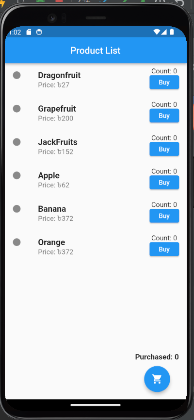
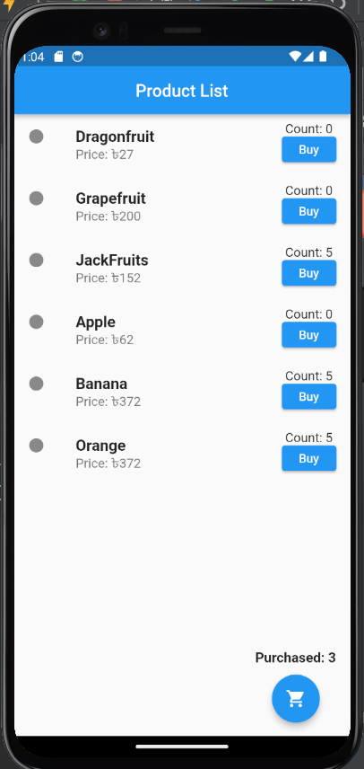
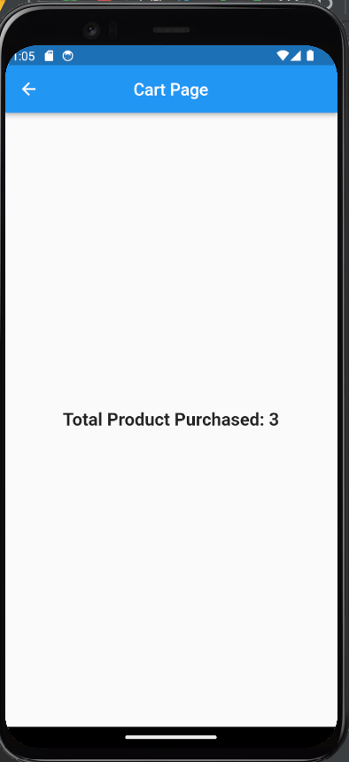

# Counter Cart App

A Flutter-based shopping cart application that allows users to browse products, add items to cart, and track their purchases. The app features a clean and intuitive interface for managing product quantities and viewing purchase history.

## Features

- Product listing with prices in BDT (৳)
- Individual product counters for purchase tracking
- Purchase milestone notifications (alerts at 5 purchases)
- Shopping cart functionality
- Total purchase counter
- Clean and responsive UI

## Screenshots

<p>




</p>

## Installation

1. Ensure you have Flutter installed on your machine. If not, follow the [official Flutter installation guide](https://flutter.dev/docs/get-started/install).

2. Clone this repository:
   ```bash
   git clone https://github.com/yourusername/counter_cart_app.git
   ```

3. Navigate to the project directory:
   ```bash
   cd counter_cart_app
   ```

4. Install dependencies:
   ```bash
   flutter pub get
   ```

5. Run the app:
   ```bash
   flutter run
   ```

## Dependencies

- Flutter SDK: >=3.1.2 <4.0.0
- cupertino_icons: ^1.0.2

## Development

This project follows standard Flutter development practices. To modify the app:

1. Main application entry: `lib/main.dart`
2. Product listing and cart logic: `lib/home_screen.dart`
3. Shopping cart view: `lib/cart_page.dart`

## Getting Started with Flutter

For help getting started with Flutter development, view the
[online documentation](https://flutter.dev/docs), which offers tutorials,
samples, guidance on mobile development, and a full API reference.

Some useful resources:

- [Lab: Write your first Flutter app](https://docs.flutter.dev/get-started/codelab)
- [Cookbook: Useful Flutter samples](https://docs.flutter.dev/cookbook)
